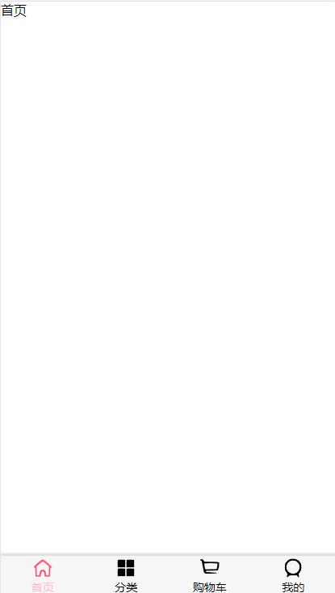

# TbaBar
一个基于vue/cli的移动端底部导航组件的封装


### 底部栏的使用

#### 一、



#### 二、

- git clone https://github.com/825221503/TbaBar.git

- tabbar放入项目组件文件夹

- 导入App.vue中 加载注册组件 挂载到app下

  -  path下写入路由路径  activeColor点击的颜色不写默认红色 如需更改 如下 

  -  item-icon: 未点击的icon
  
  -  item-icon-active 点击之后的icon
  
  -  iem-text:底部名称
  
    ```vue
    <template>
      <div id="app">
        <router-view></router-view>
        <tab-bar>
          <tab-bae-item path="/home" activeColor="pink">
            
            
            <div slot="item-text">首页</div>
        </tab-bae-item>
         如上需要几个去添加加几个    
        </tab-bar>
      </div>
    </template>
    ```
  
  - 引入方式
  
    ```javascript
    import TabBar from './components/tabbar/TabBar.vue'; // 路径根据实际去配置就好
    import TabBaeItem from './components/tabbar/TabBarItem.vue'
    export default {
      name: 'App',
      components:{
        TabBar,
        TabBaeItem
      }
    }
    ```
  
  - 最后路由配置。

